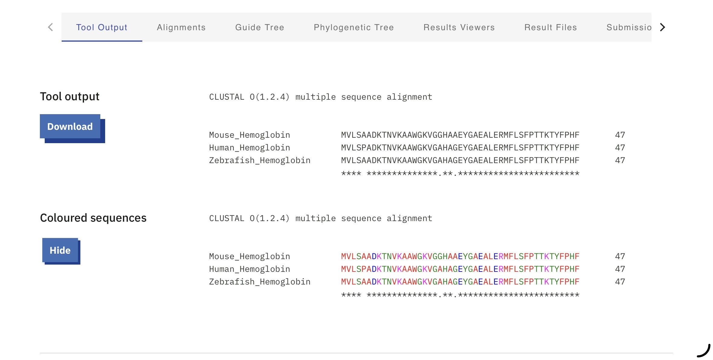

# Multiple Sequence Alignment of Hemoglobin Proteins

## 📌 Overview
This project explores multiple sequence alignment of hemoglobin protein sequences from different species using Clustal Omega.

## 🔬 Method
- Tool: Clustal Omega
- Input sequences: Human, Mouse, Zebrafish hemoglobin proteins
- Analysis of conserved and variable amino acid regions

## 📊 Key Findings
- High sequence similarity observed across species
- Several fully conserved regions identified (*)
- Minor variations reflect evolutionary divergence while preserving protein function

## 🧠 Biological Interpretation
The conserved regions suggest that hemoglobin has a highly important and preserved biological function across species, particularly in oxygen transport. Variations indicate evolutionary adaptation.

## 🛠 Skills Demonstrated
- Multiple sequence alignment
- Comparative protein analysis
- Evolutionary interpretation
- Bioinformatics tool usage (Clustal Omega)

## 📁 Files
- PDF report with full analysis
- Clustal Omega output image
  
## 📸 Output

